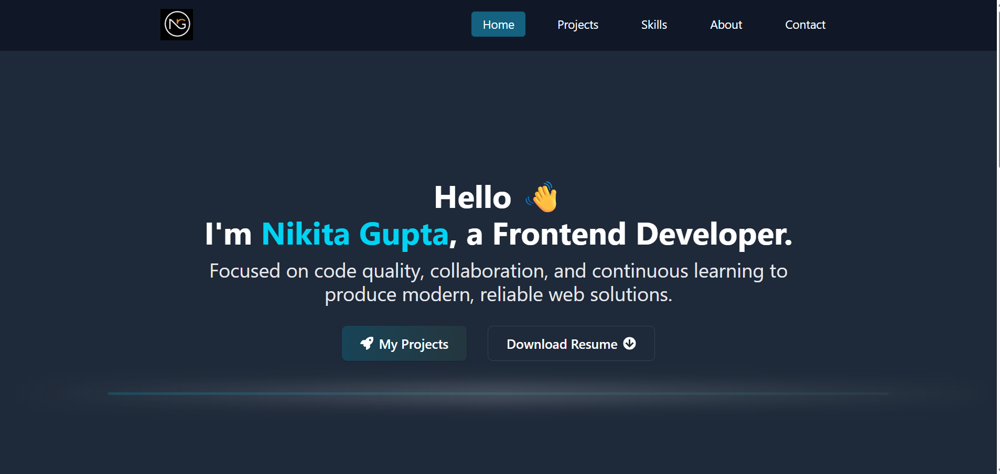

#  **My Portfolio Website** 

**This is a modern, responsive personal portfolio website built with React.js and Tailwind CSS.**  
Showcases my projects, skills, and experience with smooth navigation, scroll animations using AOS, and a user-friendly design optimized for desktop and mobile devices.

---

## 🌐 **Live Demo**

🔗 [View the live website](https://foodbook-recipe-web-by-nikitah-guptaa.netlify.app/)

---

## ✨ **Features**

** Responsive design for all screen sizes

** Smooth scrolling navigation

** Scroll animations using AOS library

** Display of projects with live links and GitHub repos

** Showcase of skills with usage of react-icons

**Mobile friendly hamburger menu

---

## 💻 **Tech Stack**

** React.js (with functional components and hooks

** Tailwind CSS for styling

** AOS for scroll animations

** React Router for routing and navigation

** React Icons for visual elements

---
## 📸 Screenshots

